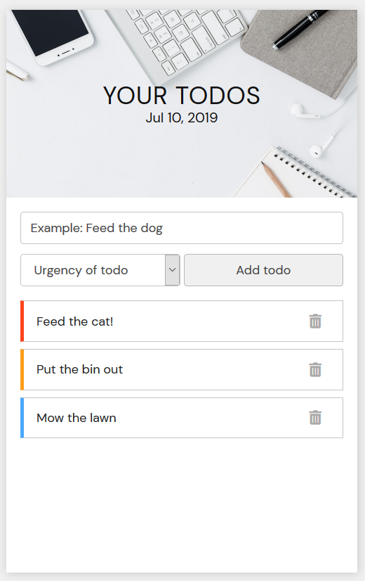
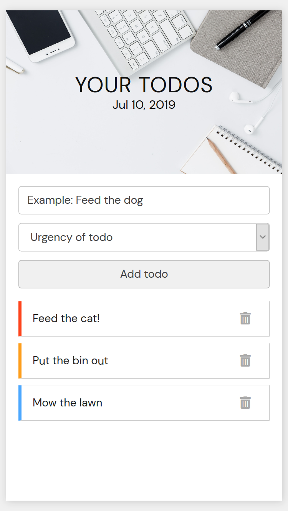

# Todo application

A todo application made with HTML/SCSS/Javascript. Fully responsive with design considered for both Desktop and mobile users. This application uses the local storage API to make the todos persistent and viewable when a user comes back to the app.

---
Desktop view             |  Mobile view
:-------------------------:|:-------------------------:
  |  

### Future considerations
In the future I would like the make this application or a different todo application that allows for CRUD, as currently it only offers Create, Read and Delete.
